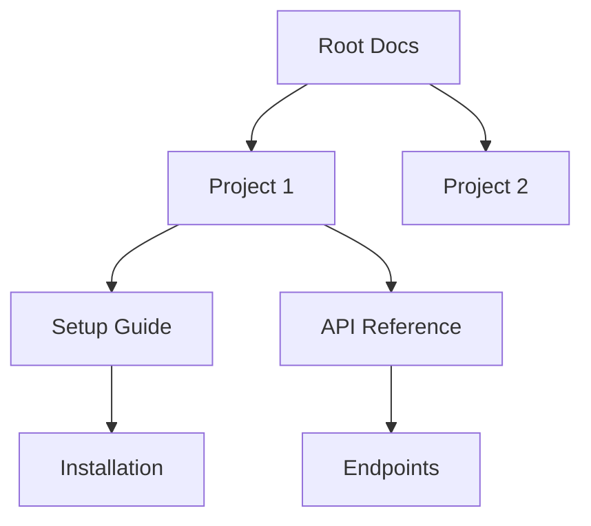

## Overview

Yogesh Agrawal provides powerful tools to streamline your project documentation workflow. You can structure content hierarchically, collaborate seamlessly with teams, search efficiently across documents, and customize the interface to match your brand.

<Columns cols={2}>
  <Card title="Organize Documents" icon="folder" href="#document-organization">
    Build intuitive hierarchies for easy navigation.
  </Card>
  <Card title="Collaborate Effectively" icon="users" href="#collaboration">
    Version control and real-time edits keep teams aligned.
  </Card>
  <Card title="Search & Filter" icon="search" href="#search">
    Find content quickly with advanced tools.
  </Card>
  <Card title="Customize Branding" icon="palette" href="#customization">
    Tailor the look to your identity.
  </Card>
</Columns>

## Document Organization and Hierarchies

Organize your documentation into nested structures resembling folders and subfolders. This creates a clear navigation tree that scales with your projects.



<Steps>
  <Step title="Create Hierarchy" icon="folder-plus">
    Start with a root page, then add child pages via the editor.
  </Step>
  <Step title="Nest Pages" icon="chevron-down">
    Drag and drop to reorder or nest content intuitively.
  </Step>
  <Step title="Publish Changes" icon="upload">
    Preview and publish your structure live.
  </Step>
</Steps>

## Collaboration and Version Control

Enable team collaboration with real-time editing and automatic version history. Track changes, revert to previous versions, and merge contributions effortlessly.

<Tabs>
  <Tab title="Real-time Edits" icon="edit-3">
    Multiple users edit simultaneously, with live previews.
  </Tab>
  <Tab title="Version History" icon="git-branch">
    Access full change logs and restore any version.
  </Tab>
</Tabs>

<CodeGroup tabs="Markdown,JSON">
  ```markdown
  # Project Setup
  ## Installation
  Install dependencies:
  ```
  ```json
  {
    "version": "1.0.0",
    "changes": ["Added setup guide", "Fixed typos"],
    "author": "team@example.com"
  }
  ```
</CodeGroup>

<Callout kind="tip">
  Use `@mentions` in comments to notify collaborators instantly.
</Callout>

## Search and Filtering Tools

Powerful search uncovers content across your entire documentation space. Filter by tags, dates, authors, or custom metadata for precise results.

| Filter Type | Description | Example |
|-------------|-------------|---------|
| Tags | Narrow by predefined labels | `api`, `setup` |
| Date Range | Find recent updates | Last 30 days |
| Author | Content by specific users | `@john.doe` |
| Full-Text | Keyword matching | "authentication" |

<Expandable title="Advanced Search Syntax" default-open="false">
  Combine filters like `tag:api AND author:john "error handling"` for targeted queries.
</Expandable>

## Customization Options for Branding

Tailor the documentation to your brand with custom themes, logos, and colors. Apply changes globally or per-space.

<CodeGroup tabs="CSS,JSON">
  ````css
  :root {
    --brand-color: #3B82F6;
    --header-bg: #1E40AF;
  }
  ````
  ```json
  {
    "theme": {
      "primaryColor": "#3B82F6",
      "logoUrl": "https://example.com/logo.png"
    }
  }
  ```
</CodeGroup>

<Callout kind="success">
  Test customizations in preview mode before applying site-wide.
</Callout>

<Columns cols={3}>
  <Card title="Quick Start Guide" icon="book-open" href="/quickstart">
    Begin organizing in minutes.
  </Card>
  <Card title="Authentication" icon="lock" href="/authentication">
    Secure your docs.
  </Card>
  <Card title="Changelog" icon="git-commit" href="/changelog">
    Stay updated.
  </Card>
</Columns>